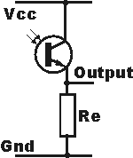
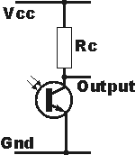
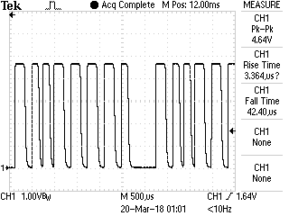
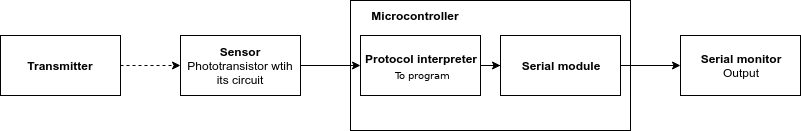
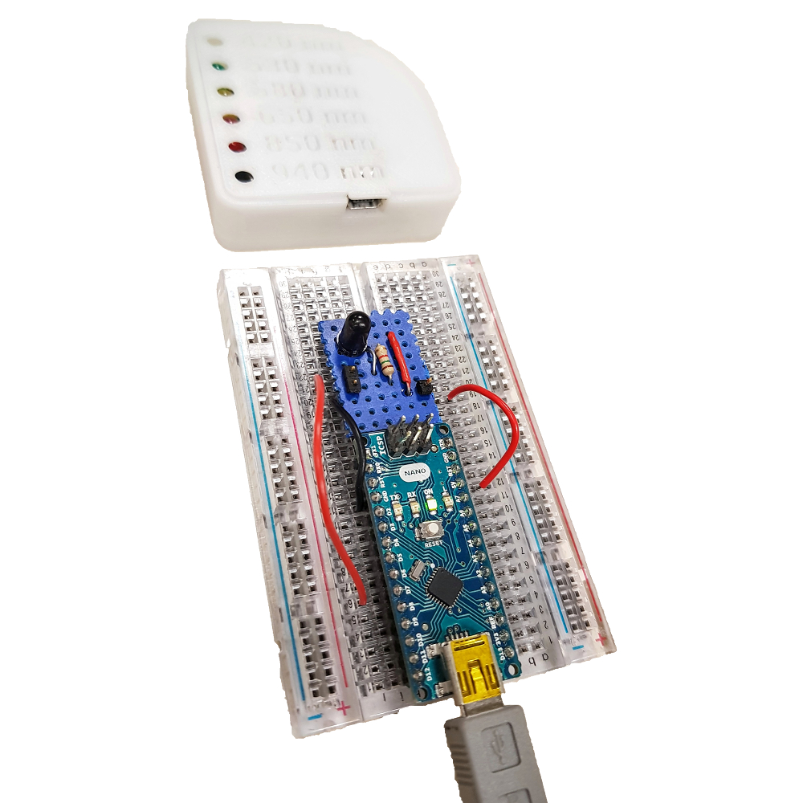
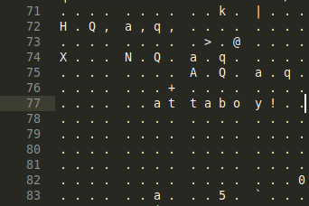
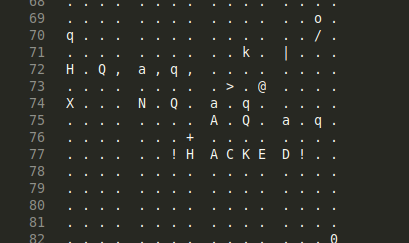

# Du capteur à la mesure : rapport de projet
*Par Nathan Pfeffenn-Deganis et Raphaël Casimir, ING4-SE*

*[Disponible sur GitHub, cliquez ici.](https://github.com/raphaelcasimir/sensor-to-measure)*

## Analyse de la datasheet du capteur OP599
Le capteur OP599 est un phototransistor qui est sensible aux longueurs d'onde infrarouges. L'avantage du phototransistor par rapport à la photodiode est qu'il est facilement possible de récupérer une tension en sortie sans composants actifs additionnels. Nous disposons de la variante OP599A.

### Caractéristiques mécaniques

* Package T-1¾ avec base TO-18 (2 fils).\newline
  *Le package est l'apparence physique du composant, permettant de prévoir son montage dans le circuit. Ici, les deux fils du capteur sont espacés de 2.54mm, ce qui est l'espacement de pins standard sur une breadboard ou une Arduino.*
* Angle de réception directif de 20 degrés (10 degrés de chaque côté du centre).\newline
  *Il sera nécessaire de placer la partie bombée du capteur bien en face de l'émetteur.*
* Le schéma et la photo montrent que le package est asymétrique et que le fil le plus long, du côté du rebord saillant, sera l'émetteur (pin 1) et l'autre le collecteur (pin 2) du phototransistor.\newline
  *Information indispensable pour monter le capteur dans le bon sens.*

### Caractéristiques électroniques

* Valeurs limites de voltage :
  - Collecteur-émetteur : 30V.\newline
  *Collecteur vers la tension d'alimentation, émetteur vers la masse. Nous utiliserons ce montage.*
  - Émetteur-collecteur : 5V.\newline
  *Émetteur vers la tension d'alimentation, collecteur vers la masse.*

* Ampérage consommé par le transistor en condition d'éclairage maximal : $I_{C(on)}
  \begin{cases}
     min = 2.35 \text{ mA} \\
     max = 3.85 \text{ mA}
    \end{cases}$ \newline
    *Sera utile pour dimentionner la résistance à utiliser dans le circuit du capteur. Nous pourrons aussi utiliser le graphique 2 de la partie performance de la datasheet (voir en annexe).* \newline

* Ampérage consommé par le transistor en condition d'éclairage minimal : $I_{CEO} = 100 \text{ nA}$ \newline
    *Ne consomme presque aucun courant dans le noir*

* Réponse spectrale typique : plus de 80% de réponse relative entre 750 et 950 nm. \newline
  *L'émetteur produit justement un pic vers 850 nm, là ou la réponse est idéale (c'est donc un capteur adapté).*

* Voltage de saturation minimal : $V_{CE(SAT)} = 0.40 \text{ V}$ \newline
  *Nous utiliserons une alimentation 3.3V ou 5V donc suffisante pour saturer le transistor*







Le transistor intégré est un NPN et il sera passant quant le capteur sera éclairé en infrarouge.
Si l'on veut que **la tension perçue en sortie monte quand le capteur est éclairé** il faudra utiliser le montage de **type 1**, si l'on veut qu'elle **baisse**, on utilisera le **type 2**.

## Conception de la chaine de mesure

Dans un premier temps nous avons décidé d'observer la sortie du capteur avec le montage de la figure 1, Rc valant 1.5 kilo Ohms.

Nous avons observé un signal numérique TTL, comme le montre la figure 3.



Le signal le plus court que le microcontrôleur aura à distinguer aura une période de 0.2 ms (5 kHz, un état haut de 0.1ms environ). Le temps de descente ou de montée étant d'une 40aine de microsecondes, la transition sera bien discernable de l'état haut ou bas (dure 5 fois moins longtemps).

La chaine de mesure nécessaire est alors très simple, présentée en figure 4.



L'émetteur envoie un signal lumineux infrarouge reçu par le capteur qui le transforme en signal électrique / niveaux logiques. Ensuite ce signal est transmis à un pin numérique du microcontrôleur, ce qui permet d'interpréter l'information selon le protocole de communication utilisé par l'émetteur. Enfin, l'information traitée, les caractères résultants sont envoyés via le module série du microcontrôleur sur le moniteur série d'un ordinateur par exemple.

Voici un premier jet de l'algorithme permettant de décoder le protocole de l'émetteur, et donc récupérer le message (pseudo-code) :

```c
// Algorithme / pseudo-code
int first = 0; // première valeur de  temps
int second =0; //// première valeur de  temps
int res = 1; /// valeur de l'écart
///ascii tableau de caractère ascii caractère ASCII
char Ch[100]; /// tableau tampon pour les caractères
int i = 0; /// incrémentation des chars 
int j= 0; /// incrémentation des bits
bool which = 0; /// choix de la valeur de temps
int ends = 0; /// choix de temps
int inPin;
void setup() {
// Input mode for the pin which will receive the signal inPin

}

void loop() {
  // Si nous n'avons pas reçu le signal de départ
  if (ends == 0){
  inPin = 1;
    if () // si la lecture du pin est à 0
       if (which == 0){  
          which = !which;
          first = micros()// first prend le temps depuis 0  
          }
        else{
          which = !which;
          second = micros();// second prend le temps depuis 0  
          end = second - first; // end récupère la valeur entre
          // les deux derniers falling edge
          }
       if () // si end est compris entre deux valeurs très proche
       // de la période attendue
       { ends = 1;
         }
  }
  //si le signal démarre
   if (ends == 1){
  inPin = 1;
    if () // si la lecture du pin est à 0
       if (which == 0){  
          which = !which;
          first = micros()// first prend le temps depuis 0  
          }
        else{
          which = !which;
          second = micros();// second prend le temps depuis 0  
          end = second - first; // end récupère la valeur entre les deux
          // derniers falling edge
          }
       if () // si ends compris entre deux valeur très proche de la période
       // attendue entre le dernier bit et le bit de départ 
       { ends = 2;
         }
        else if()//temps pour un 0
       {
         ascii[j] = 0;
         j++;
       }
       else if()//temps pour un 1
       {
         ascii[j] = 0;
         j++
       }
       else if()//temps pour un espace
       {
         j==0
         //Conversion de ascii dans char[i] grâce au code ascci donné
         // dans un des exemples arduino
        i++; 
       }}
       if (ends ==2){
       //affichage du tableau de char avec serial  
       }
}

```

## Réalisation

### Valeur de la résistance

Le montage réalisé est un montage émetteur-collecteur avec la résistance à la masse. Pour choisir la valeur de la résistance nous utilisé l’ampérage donné dans la partie *lecture de la Datasheet* de notre rapport.
Cette résistance est obligatoire pour ne pas avoir de court-circuit quand le transistor est saturé, et pour permettre de lire le signal provenant du capteur.

Nous avons comme calcul :

*I = U/R avec U = tension d’alimentation – tension de saturation* (donnée dans la datasheet)

*I =  (5 – 0.40)/R*

Nous avons décidé de prendre une résistance R de valeur *R = 1,5 kOhm* pour avoir une intensité égale à 3,06mA, qui se place au centre entre les valeurs minimum et maximum d’intensité données dans la datasheet *(min = 2.35mA , max = 3.85mA)*



\newpage

### Première version du code

Après avoir fini la conception de la chaine de mesure, nous avons voulu repartir de l'algorithme en pseudo code. Mais après une séance infructueuse, nous nous sommes rendus compte que ce squelette était mauvais. Le code et l'architecture n'était pas assez "propre", entre les noms de variables peu clairs, la structure brouillon et le manque de sous-fonctions.

Cela nous empêchait d'avoir une vision claire des opération effectuées par le code. De plus nous souhaitions récupérer et traiter les valeurs immédiatement tout en affichant des résultats à l'écran. Mais avec la lenteur de l'écriture serial au nombre de baud par défaut et les erreurs de conception, nous n'avions que des valeurs erronées et difficiles à analyser.

Nous avons donc décidé de changer l'algorithme et de repartir depuis un fichier vierge.

### Seconde version du code

#### Déclaration des variables

```c
define IP 7 // Input pin

#define WAIT 0 // Waiting for start condition
#define LISTEN 1 // Listening for first byte
#define STOP 2 // Message recorded, sending


unsigned long t; // Valeur de  temps

int res = 0; /// valeur de l'écart

///ascii tableau de caratère ascii caractère ASCII
byte currentByte = 0;
char currentBit = 0;
unsigned int sum;
int timeStore[8];

char finalBytes[20]; /// tabelau final pour les caractères
char finalCount = 0;

int i = 0;

int j= 0;
int k= 0;
int count =0;

char val = 0;
char prev=0;

char updt=0;

unsigned long lastUpdtTime=0;
unsigned long updtTime=0;
```

#### Le setup

Nous avons accéléré la vitesse de transmission (*datarate* donnée en paramètre de `serial.begin()` ) pour pallier les problèmes rencontrés avec la première version du code.

```c
void setup() {
// Input mode for the pin which will receive the signal Inpin
pinMode(IP, INPUT);
Serial.begin(115200);
}
```

#### La réception du signal

La première étape de la réception est la détection des fronts montants et descendants (commentées dans le code ci-dessous).
On récupère dans *res* la différence temporelle entre le front montant et front descendant.

```c
void loop() {

  val = digitalRead(IP); // Getting the state of input pin
  
  if(val && !prev){ // If IP state changed from 0 to 1
    prev = 1; // Update the current state (future PREVious state)
    t = micros(); // Take time measure
  }
  if(!val && prev) // If it switched back from 1 to 0
  {
    prev = 0; // Update current state
    res = micros() - t; // Store the "HIGH" duration
    updt=1; // Tell the rest of the program that a new info has arrived
    lastUpdtTime = millis();
  }
  if((0 != lastUpdtTime) && (WAIT != state)){
      updtTime = millis() - lastUpdtTime;
  }
```

Cette portion de code permet de détecter la condition de fin (un temps long sans front montant détecté).

```c
  if (updtTime > 6) {
    state = STOP;
  }
 ```

#### Le traitement du signal
 
 On détecte la condition de départ
 
 ```c
  if (updt || (STOP == state)) { // Start processing

    if( (res > 280) && (res < 420) ){ // Start condition
      state = LISTEN;
      updt = 0;
    }
```
Une fois la condition détectée, et qu'une mise à jour est nécessaire alors on appelle timeToByte(), la fonction chargée de la traduction des valeurs temporelles en bits.

```c
    if ((LISTEN == state) && (1 == updt)){
      if(timeToByte(res)){
        finalBytes[finalCount] = currentByte;
        finalCount++;
      }
    }
```

#### La traduction du signal

Pour la traduction, la première étape est de stocker les 8 temps reçus, correspondant au 8 bits d'un caractère dans un tableau. On additionne les temps envoyés pour pouvoir calculer le temps moyen à la fin de chaque caractère. Le but de la manœuvre est de filtrer les variations de fréquences du message d'origine, et d'éviter d'entrer les conditions de détection à la main. Une simulation (avec cas extrêmes) faite en entrant des temps enregistrés dans un tableur, et appliquant ce traitement, a montré une grande robustesse de cette méthode.

Nous pouvons remarquer que le code ASCII ne contient pas de caractères composés exclusivement de 0 ou de 1.

```c
bool timeToByte(unsigned int time) {

  timeStore[currentBit] = time; // Storing current time for translation
  currentBit++;

  sum += time;
```
Si on a les 8 temps, on va diviser chaque temps par la somme. Si ce temps est inférieur à la durée du temps moyen d'une impultion, *Somme/8*, alors c'est un 1 (signal court). Sinon c'est un 0 (signal long).

On écrit alors directement dans un caractère le bit reçu à l'aide d'opérations binaires :
- Si c'est un 0, on opère un décalage à droite (on ajoute un 0 sur le lsb et le msb est remplacé par le second bit) *currentByte = currentByte << 1;*
- Si c'est un 1, on opère un décalage à droite et on fait un complément pour changer le LSB à 1

```c
currentByte = currentByte << 1;
currentByte = currentByte | B00000001;
```

On aura alors un caractère de rempli.
On répète l'action pour chaque caractère.

```c
  if(currentBit == 8) {
    
    currentByte = 0;
    sum = sum/8;

    for(currentBit = 0; currentBit < 8; currentBit++) {
      // Remark : no ASCII character is all 0 or all 1
      if(timeStore[currentBit] < sum) { // HIGH
        currentByte = currentByte << 1;
        currentByte = currentByte | B00000001;
      }
      else { // LOW
        currentByte = currentByte << 1;
      }
    }
    currentBit = 0;
    sum = 0;
    return 1;
  }
  else
    return 0;
}
```
\newpage

#### L'affichage du signal

Cette partie permet l'affichage du message reçu.

```c
    if(STOP == state) {

      finalBytes[finalCount] = '\0';
      Serial.print("Message is : ");
      Serial.println(finalBytes);
      Serial.println("");
```
Ici un blindage ajouté après la détection d'une erreur lors d'une mauvaise lecture due à un mouvement brusque de l'émetteur.

```c
      // Hardenning: in case of misreading, start over
      finalCount = 0;
      currentBit = 0;
      currentByte = 0;
      sum = 0;
```

### Le fichier binaire de l'émetteur

Après une mauvaise manipulation, nous avions téléversé le code tu récepteur sur la nano du module émetteur. Nous avons donc du récupérer le fichier binaire d'un autre émetteur pour réparer notre émetteur.

Nous en avons profiter pour ouvrir le fichier binaire de l'émetteur. Nous en avons profiter pour vérifier que le mot décodé par le groupe d'Hugo Massis était bien "attaboy!".



Nous avons aussi pu changer le message émis pour des tests de notre code. Notamment les caractères avec un seul *0* ou un seul *1* dans leur code binaire dans la table ascii.



\newpage

### Résultat

Voici le screenshot du résultat obtenu avec l'émetteur classique puis avec l'émetteur modifié.

 

## Collaboration

Le groupe de Hugo Massis nous a fourni le message décodé ce qui nous a aidé pour les tests du code.

Nous avons fourni notre code et notre rapport en direct de notre avancement à l'ensemble de la classe en utilisant un *[dépôt Github](https://github.com/raphaelcasimir/sensor-to-measure)*.
     
\fakesection{Annexes}
\includepdf[pages={1-3}]{OP599_Series_datasheet_annotee.pdf}